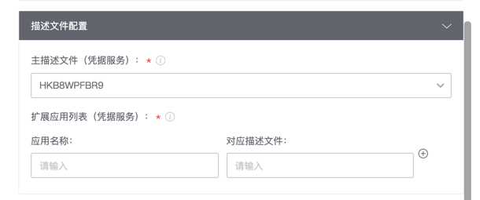

# iOS重签名插件本地版

**⚠️ 此插件仅在macOS环境下使用，请在上架插件时注意勾选**

### Step 1. macOS环境准备工作

- 打开macOS自带的证书管理软件keychain（钥匙串访问）

- 将用于重签名的p12文件导入进证书列表，如果出现证书不受信任问题可以先导入证书文件 cer/Apple Common Certificate.cer

- 双击进入企业证书，获取证书的SHA1值，用于后面的指定证书ID

### Step 2. 导入签名构建机并配置流水线

- 在“环境管理”服务中，新增第三方构建机，导入即将用于签名操作的macOS机器

- 配置流水线时，选用macOS构建机并选用用于签名的机器

### Step 3. 插件配置选项和对应功能

#### 基础配置

- ipa文件路径：填写需要进行重签的ipa包路径，支持通配符、相对路径
- 是否进行bundleID替换：如果选择替换则将以描述文件内的bundleID作为签名后的包bundleID
- 证书ID：从keychain中复制的SHA1值
- 描述文件指定方式：支持本地文件或凭据服务中上传的证书文件
- UL域名：即Universal Link功能配置的跳转链接前缀
- 钥匙串访问组：需要在描述文件中主动写入的访问组

#### 描述文件配置

- 主描述文件：最外层主app对应的描述文件（必填）
- 拓展应用描述文件：当有内部拓展应用时，选择Plugins目录下appex分别对应的描述文件

#### 其他配置

- Info.plist内的特殊值替换配置：可以自定义替换plist中的值，例如有watch app时，可以利用该配置替换相关Bundle值
- 重签名IPA包文件名后缀：自定义产物的后缀，用于多个版本重签时的区分

### Step 4. 重签后的产物下载

- 插件执行结束后可以在工作空间下找到签名后的ipa包，也可以直接在“查看构件”里获取归档结果

### 注意

- 签名过程会在工作空间产生以.mp和.sign_tmp开头的中间产物文件
